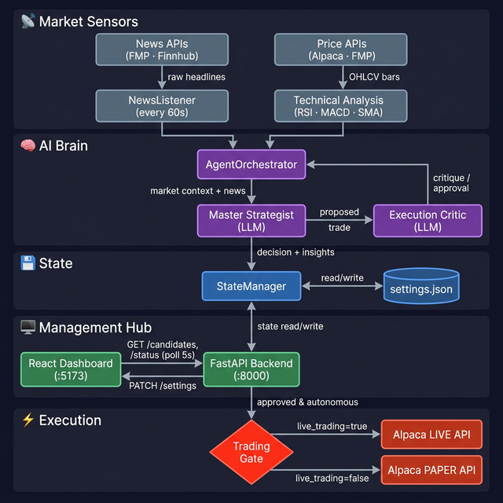

# Antigravity Trading Bot: Management Hub & Architecture

Welcome to the **Antigravity Trading Hub**. This platform is a news-driven, AI-augmented trading system designed to run on a VM, monitor the markets 24/7, and provide a high-aesthetic management interface for human-in-the-loop decision making.

---

## 🧠 System Architecture

The platform follows a modular, agentic architecture where data flows from external sensors through an AI decision engine, into a central **State Manager**, and finally to the **Management Hub** (React + FastAPI) for visualization and control.



---

## 🚀 Getting Started

### Prerequisites

| Tool | Version | Purpose |
|:-----|:--------|:--------|
| **Python** | 3.10+ | Backend & AI agents |
| **Node.js** | 18+ | React frontend |
| **npm** | 9+ | Dependency management |

### 1. Clone & set up the Python environment

```powershell
# Create and activate a virtual environment
python -m venv venv
.\venv\Scripts\Activate

# Install Python dependencies
pip install -r requirements.txt        # if requirements.txt exists
# — or install individually —
pip install fastapi uvicorn alpaca-trade-api python-dotenv
```

### 2. Configure environment variables

Create a `.env` file in the project root with your API keys:

```dotenv
# Alpaca API Credentials (Paper Trading)
ALPACA_API_KEY=your_alpaca_key
ALPACA_SECRET_KEY=your_alpaca_secret
ALPACA_BASE_URL=https://paper-api.alpaca.markets

# Financial Modeling Prep (Smart Money / News)
FMP_API_KEY=your_fmp_key

# Finnhub (News)
FINNHUB_API_KEY=your_finnhub_key
```

### 3. Install the frontend

```powershell
cd frontend
npm install
cd ..
```

### 4. Start the application

#### Option A — One-click start (recommended)

Run the PowerShell helper script from the project root:

```powershell
.\run_app.ps1
```

This starts the **backend** in a new terminal window and the **frontend** in the current one.

#### Option B — Start each service manually

**Terminal 1 — Backend (FastAPI)**

```powershell
.\venv\Scripts\Activate
uvicorn api.main:app --host 0.0.0.0 --port 8000
```

**Terminal 2 — Frontend (React + Vite)**

```powershell
cd frontend
npm run dev
```

### 5. Open the dashboard

Once both services are running, open the Management Hub at:

```
http://localhost:5173
```

The React dashboard will connect to the FastAPI backend at `http://localhost:8000` automatically.

---

## 🌊 Data Flow & Decision Making

### 1. Sensing (The News Monitor)
The bot doesn't just look at price charts; it listens for *catalysts*.
- **Frequency**: Every 60 seconds, the `NewsListener` scans for headlines related to your **Watchlist** (configured in the Settings).
- **Sentiment Filter**: Headlines are passed through an initial sentiment filter to see if the news is "actionable" (e.g., earnings beat, product launch, regulatory shift).

### 2. The AI Debate (The Brain)
When a catalyst is detected, the **Agent Orchestrator** starts a "Debate":
- **The Strategist**: Analyses the news context + technical indicators (RSI, MACD) + Smart Money sentiment (FMP logic). It proposes a trade with a specific signal (BUY/SELL), confidence score, and rationale.
- **The Critic**: Acts as a risk officer. It tries to find reasons *not* to trade (e.g., overbought RSI, high volatility, low liquidity).
- **The Consensus**: A signal is only "Approved" if the Critic validates the Strategist's proposal.

### 3. State & Visualization
All results—including rejected proposals—are stored in the **State Manager**.
- The **Candidate Hub** in the frontend shows these in real-time.
- **Deep-Dive Insights**: You can click any candidate to see the specific technical indicators and the internal AI rationale.

## 🤖 Operation Modes: Autonomous vs. Proposed

The platform handles trades differently based on your **System Management Settings**:

| Feature | **Autonomous Mode** (Auto-Pilot) | **Proposed Stocks** (Manual Mode) |
| :--- | :--- | :--- |
| **Execution** | Trades are sent to Alpaca immediately upon Consensus. | Bot waits for you to click "Approve" on the card. |
| **Use Case** | HFT/Scalping where speed is critical. | Long-term strategy or high-stakes Real Money trading. |
| **Safety** | Relies entirely on the AI Critic's guardrails. | Human oversight is the final safety layer. |
| **Notification** | Logs the trade and updates P&L. | Highlights the card and pulses to grab your attention. |

## 🛡️ Safety & Controls
- **Live/Paper Switch**: Swap between the Alpaca Paper environment (Simulation) and Live environment (Real Money).
- **Risk Aggression**: Scale the position sizes (0.5x to 2.0x) to control your exposure.
- **Watchlist**: Dynamically adjust which assets the bot "listens" to without restart.

---
*Created by Antigravity AI.*
